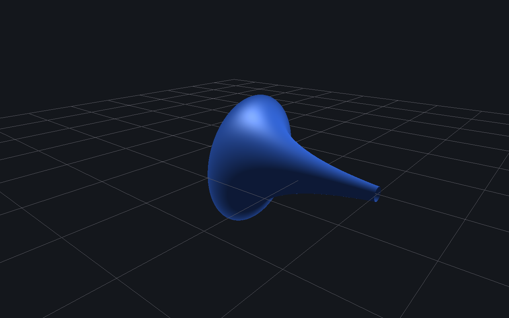
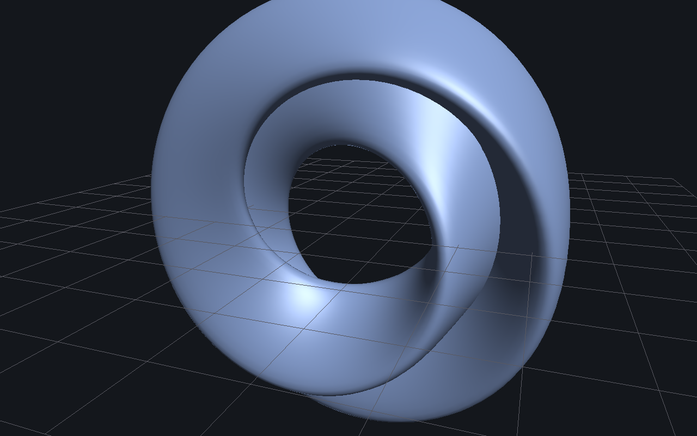
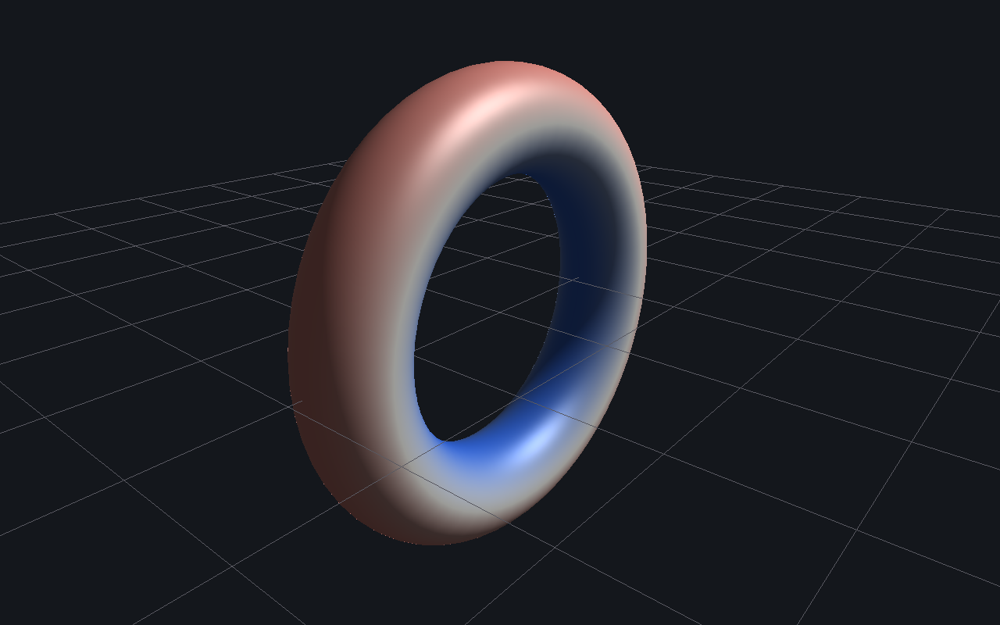
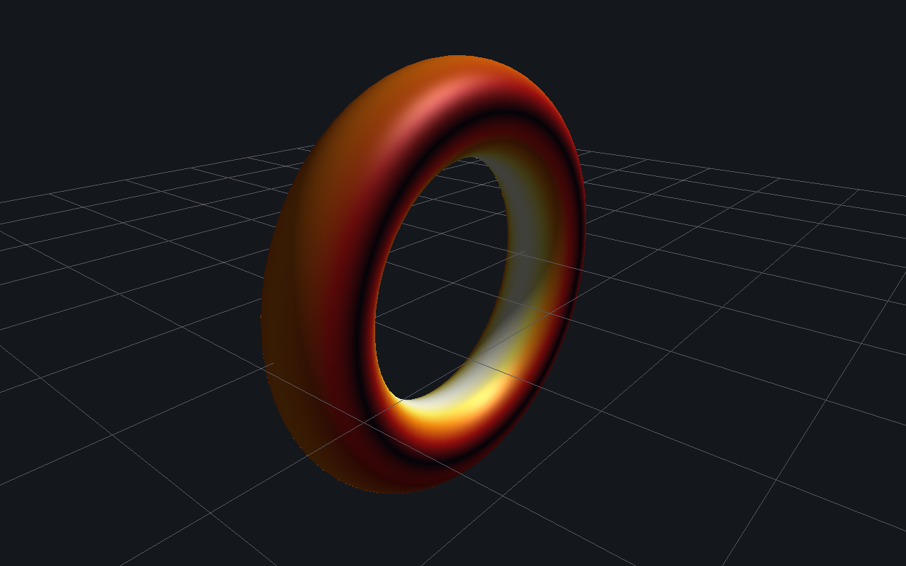

# egregium

[](https://github.com/HanielUlises/egregium/releases)
[](LICENSE)

Interactive visualization of surfaces and manifolds in differential geometry.
A surface is specified by a formula and rendered in three dimensions together
with its Gaussian curvature $K$ and its geodesics, both obtained by exact
symbolic differentiation rather than finite-difference approximation. The
name refers to Gauss's *Theorema Egregium*: $K$ is an intrinsic invariant of
a surface, determined entirely by its metric, independent of any embedding
in $\mathbb{R}^3$.

<p align="center"></p>

## Overview

A surface is described in one of four forms:

| Kind | Definition | Domain |
|---|---|---|
| Explicit | $z = f(x,y)$ | $(x,y) \in [x_{\min},x_{\max}] \times [y_{\min},y_{\max}]$ |
| Parametric | $(u,v) \mapsto \big(x(u,v),\,y(u,v),\,z(u,v)\big) \in \mathbb{R}^3$ | $(u,v) \in [u_{\min},u_{\max}] \times [v_{\min},v_{\max}]$ |
| Implicit | $F(x,y,z) = 0$, raymarched, not tessellated | bounding cube $[b_{\min},b_{\max}]^3$ |
| Metric | first fundamental form $\mathrm{I} = E\,du^2 + 2F\,du\,dv + G\,dv^2$, with an optional embedding for display | $(u,v) \in [u_{\min},u_{\max}] \times [v_{\min},v_{\max}]$ |

Every formula is parsed and symbolically differentiated (`src/expr`) rather
than numerically approximated, so the quantities built on top of it are
exact to floating-point precision:

- **Gaussian curvature**, via the Brioschi formula applied to the active
  first fundamental form — the metric induced by the embedding by default,
  or an explicit override. The Hyperboloid Model and Poincaré Disk demos use
  the latter deliberately: the embedded shape and the metric governing its
  curvature disagree on purpose, which is the point of those two demos.
- **Geodesics**, by RK4 integration of the geodesic ODE from a chosen point
  and direction.

A built-in gallery covers classical surfaces (torus, Möbius strip, Klein
bottle, catenoid, Enneper's surface, ...) and models of non-Euclidean
geometry (sphere, pseudosphere, the hyperboloid and Poincaré models of the
hyperbolic plane, the flat torus). A formula editor lets you define and
tessellate an arbitrary surface of any of the four kinds above.

## Formula language

Variables are bound by context: $x,y$ for an explicit height field, $u,v$
for a parametric map or a metric, $x,y,z$ for an implicit surface.
Referencing an unbound variable is a parse error, not an implicit zero.

The grammar admits the arithmetic operators $+,\ -,\ \times,\ \div,\ {}^\wedge$
with standard precedence and unary $\pm$; the constants $\pi$ and $e$; and
the functions

$$\sin,\ \cos,\ \tan,\ \arcsin,\ \arccos,\ \arctan,\ \mathrm{atan2},\ \sinh,\ \cosh,\ \tanh,\ \exp,\ \log,\ \sqrt{\cdot\,},\ |\cdot|,\ \lfloor\cdot\rfloor,\ \min,\ \max,\ (\cdot)^{(\cdot)}$$

$\min$ and $\max$ are admissible inside an implicit formula $F(x,y,z)=0$,
which is raymarched and never differentiated, but are rejected in a height
field, embedding, or metric — those are symbolically differentiated, and
$\min,\max$ are not smooth. The parser reports this directly rather than
silently producing incorrect curvature.

## The twisted wrap

`geo::tessellate` (`src/geometry/mesh_tessellate.cpp`) samples a $(u,v)$
grid and can close it into a loop along either axis. A few immersions — the
Klein bottle chief among them — identify $u = u_{\max}$ with $u = u_{\min}$
under $v \mapsto -v$ rather than a plain repeat, a consequence of being
built from a half-angle term such as $\cos(u/2)$. A plain periodic wrap
stitches the wrong vertices together and leaves a visible seam.

<p align="center"></p>

The identification is also orientation-reversing, which is not a
tessellation detail but a property of the surface itself. Differentiating
the shared-point identity $X(u+2\pi,\,-v) \equiv X(u,v)$ with respect to $v$
shows $X_v$ changes sign while $X_u$ does not, so the surface normal
$X_u \times X_v$ flips sign across the seam — a direct, computable instance
of the Klein bottle's non-orientability. `periodicUTwistV` closes the mesh
by mirroring the $v$ index at the seam and duplicating that ring of
vertices with negated normals, so the identification renders as a single
clean crease rather than as interpolated lighting noise. It is exposed in
the Add Surface dialog for any user-defined half-angle-twist immersion, and
is what the built-in Klein Bottle demo uses.

## Curvature colormaps

Surfaces can be colored by Gaussian curvature two ways, toggled per object
in the Scene inspector or set at creation time:

<p align="center">
  
  
</p>

- **Diverging** (default) — signed: blue where $K<0$, red where $K>0$,
  neutral near $K=0$. The sign is the point for most of the non-Euclidean
  demos.
- **Heatmap** — sequential, driven by $|K|$ on a black–red–orange–yellow–white
  ramp, for when the magnitude of curvature matters more than its sign.

## Building

Dependencies: OpenGL, GLFW ($\geq 3.3$, auto-fetched if no system package is
found), GLM (header-only, auto-fetched), GLEW (system package required —
CMake fails fast with install instructions if it's missing), Dear ImGui and
stb_image_write (vendored, not committed to this repository).

```sh
# one-time: vendor ImGui and stb_image_write
git clone --depth 1 --branch v1.91.0 https://github.com/ocornut/imgui.git external/imgui
curl -fsSL -o external/stb/stb_image_write.h \
  https://raw.githubusercontent.com/nothings/stb/master/stb_image_write.h

cmake -B build -DCMAKE_BUILD_TYPE=Release
cmake --build build -j
./build/manifold_graph
```

`manifold_graph` also accepts an optional
`--shot "<demo>;<output.png>[;yaw[;pitch[;distance[;colormap]]]]"` argument
(repeatable), which loads a built-in demo, places the camera, and writes a
clean, UI-free screenshot within a single run of the program — this is how
the images in this document were produced. Run with `--help` for the full
option list.

## Controls

- Left-drag: orbit camera · Right-drag: pan · Scroll: zoom
- **Demos** menu: load a built-in example
- **Add** menu: define your own surface from a formula
- **Scene** panel: select an object to inspect it, toggle wireframe/curvature
  coloring, or shoot a geodesic from a chosen point and direction
